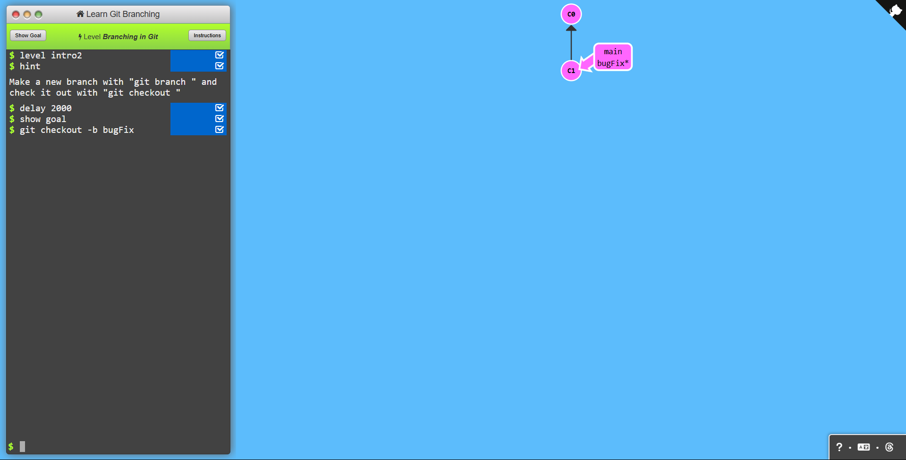
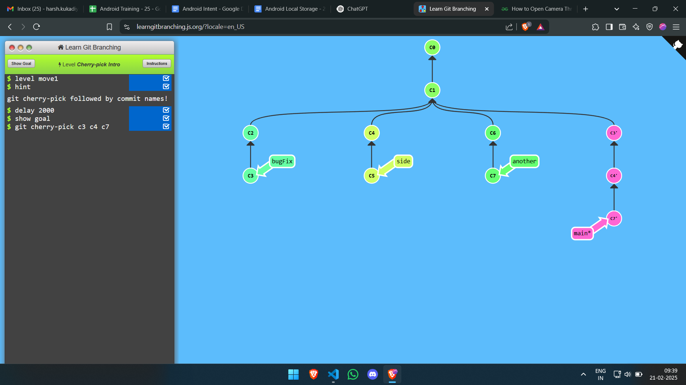

# Learn-git-branching

## Level 1

### Task 1
```bash
git commit
```


### Task 2
```bash
git checkout -b bugFix
```


### Task 3
```bash
git checkout -b bugFix
git commit
git checkout main
git commit
git merge bugFix 
```


### Task 4
```bash
git checkout -b bugFix
git commit
git checkout main
git commit
git checkout bugFix
git rebase main
```


## Level 2

### task 1

```bash
git checkout c4
```


### task 2

```bash
git checkout HEAD^
```


### task 3

```bash
git checkout c6
git branch -f main HEAD
git branch -f bugFix HEAD~4
git checkout c1
```


### task 4

```bash
git reset HEAD~1
git checkout pushed
git revert HEAD
```


## Level 3

### Task 1

```bash
git cherry-pick c3 c4 c7
```



### Task 2

```bash
git rebase -i HEAD~4
```


## Level 4

### Task 1

```bash
git checkout main
git cherry-pick c4
```


### Task 2

```bash
git rebase -i HEAD~2
git git commit --amend
git rebase -i HEAD~2
git branch -f main c3''
```


### Task 3

```bash

git checkout main
git cherry-pick c2
git commit --amend
git cherry-pick c3

```


### Task 4

```bash
git tag v0 c1
git tag v1 c2
git checkout v1
```


### Task 5

```bash
git describe <branch/commit-hash>
```


## Level 5
### Task 1

```bash
git rebase main bugFix
git rebase bugFix side
git rebase side another
git branch -f main another
```


### Task 2

```bash
git branch bugWork main~1^2~1
```


### task 3

```bash
git checkout one
git cherry-pick c4 c3 c2
git checkout two
git cherry-pick c5 c4 c3 c2
git branch -f three c2
```


